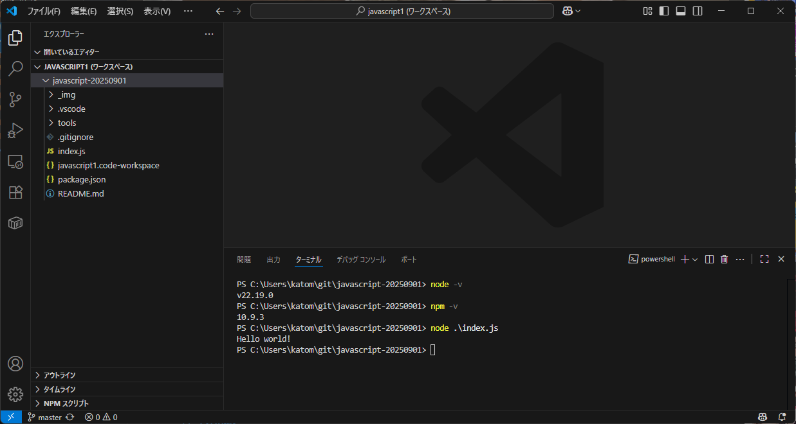

> [!CAUTION]
> 以下 `node` コマンドで実行してくださいと指定されている箇所を以下のように置き換えてください。
> - `node ...` → `.\tools\node.exe ...`
> - `npm ...` → `.\tools\npm.cmd ...`

# おまけ サーバーサイドのJavaScriptを動かしてみよう

## セットアップ

1. 当ページの `Code > Local > Download ZIP` より開発資材のダウンロードを行ってください
   
2. ZIPファイルをデスクトップで解凍し、VSCodeを `javascript1.code-workspace` ファイルから開いてください。
3. VSCodeのメニューバーの `ターミナル > 新しいターミナル` よりWindowsのターミナル（PowerShell）をVSCode上で開き、以下のコマンドで正しく結果が出力されるかを確認してください。
   ```shel
   > node -v
   v22.19.0
   > npm -v
   10.9.3
   > node .\index.js
   Hello world!
   ```
   

## nodeコマンドによるJSファイルの実行

ブラウザでは `<script>` タグでJSを実行していましたが、Node.js ではターミナル上で直接コマンドを使って実行します。

例: `./hello.js` を作成し、以下を記述します。
```js
console.log("Hello from Node.js!");
```

実行:
```
node ./hello.js
```

### コマンドライン引数を受け取る

Node.js ではコマンドライン引数を `process.argv` から取得できます。

例: `./greet.js`
```js
process.argv[0]; // → Node.js 実行ファイルのパス
process.argv[1]; // → 実行中のスクリプトファイルのパス
process.argv[2]; // 以降 → コマンドに渡した引数

const args = process.argv.slice(2); // 2番目以降を取り出す
const name = args[2] ?? "名無し";

console.log(`Hello, ${name}!`);
```
実行:
```
node ./greet.js Kato
```
出力例:
```
Hello, Kato!
```

### 練習問題

1. `./echo.js` を作成し、渡された引数をすべて表示するプログラムを書いてみましょう。
   * 実行例:
     ```
     node echo.js apple banana orange
     ```
     出力例:
     ```
     apple
     banana
     orange
     ```
2. `./calc.js` を作成し、次のようにコマンドライン引数を使って足し算をするプログラムを書いてみましょう。
   * 実行例:
     ```
     node calc.js 10 20
     ```
     出力例:
     ```
     結果: 30
     ```
3. 上記の `./calc.js` を改造して、3つ以上の数を入力したときも合計できるようにしてみましょう。


## JavaScriptファイルの分割とimport及びexport

Node.js では、ファイルを分割してモジュールとして利用することができます。

> [!NOTE]
> Node.JSではファイルの分割及び呼び出す方法として `CommonJS` と `ES Modules` の2種類が用いられますが、今回は `ES Modules` 形式の利用方法を説明します。

### 例: 足し算関数を別ファイルに分割する

`./math.js`

```js
export function add(a, b) {
  return a + b;
}
```

`./main.js`

```js
import { add } from "./math.js";
// 又は import math from "./math.js";

console.log(add(2, 3)); // 5
// 又は console.log(math.add(2, 3)); // 5
// {} で読み込んだファイルの特定のexportしたものだけ呼び出せる
// 全て呼び出すなら {} なしでファイル全体を呼び出すこともある
```

実行:

```shell
node ./main.js
```

### 練習問題

1. `./math.js` に「引き算」「掛け算」「割り算」の関数を追加してみましょう。
2. `./main.js` からそれぞれ呼び出して結果を出力してみましょう。

## ファイルの読み書き

Node.js にはファイルを扱うための組み込みモジュール `fs` があります。

### 例: テキストファイルの読み込み

`./read.js`

```js
import { readFileSync } from "node:fs";

const data = readFileSync("./sample.txt", "utf-8");
console.log("読み込んだ内容:", data);
```

### 例: ファイルへの書き込み

`./write.js`

```js
import { writeFileSync } from "node:fs";

writeFileSync("./output.txt", "Hello Node.js!");
console.log("output.txt に書き込みました");
```

### 練習問題

1. `./log.js` を新規作成し `./log.txt` に、コマンドライン引数で渡した引数をスペース毎に全て改行区切りで書き込むプログラムを作ってください。
2. その後、書き込んだ内容を読み出してターミナルに表示してください。

例:

```
> node ./log.js これ は log.js の ファイル の 書き込み テスト です
> cat ./log.txt
これ
は
log.js
の
ファイル
の
書き込み
テスト
です
```


## ライブラリの利用

Node.js では `npm` を使って外部ライブラリを追加できます。  
`npm` コマンドで追加できるライブラリは https://www.npmjs.com/ から入手することができます。

### 例: 日付操作ライブラリ `dayjs` の利用

[dayjs - npm](https://www.npmjs.com/package/dayjs)

```shell
npm install dayjs
```

`./date.js`

```js
import dayjs from "dayjs";

console.log("現在の日時:", dayjs().format("YYYY-MM-DD HH:mm:ss"));
```

実行:

```shell
node date.js
```

### 練習問題

1. `./dayjs.js` ファイルを新規作成して `dayjs` を使って、自分の誕生日が今年は何曜日かを**漢字で**console.log出力するプログラムを作りましょう。
   * ヒント: `dayjs("2025-01-01").format("dddd")`
2. `./dayjs.js` に今日から100日後の日付をconsole.log出力する処理を追記してください。

## テストコードの作成

本格的な開発では「テストコード」を書いて動作確認をします。Node.js には組み込みのテストランナーがあります。

### 例: 簡単なテスト

`./math.js`

```js
export function add(a, b) {
  return a + b;
}
```

`./math.test.js`

```js
import { test } from "node:test";
import assert from "node:assert";
import { add } from "./math.js";

test("add 関数のテスト", () => {
  assert.strictEqual(add(2, 3), 5);
});
```

実行:

```shell
node --test
✔ add 関数のテスト (1.1902ms)
ℹ tests 1 # テストの総数
ℹ suites 0
ℹ pass 1 # 成功した件数
ℹ fail 0 # 失敗した件数
ℹ cancelled 0 # キャンセルしたテスト件数
ℹ skipped 0 # スキップしたテスト件数
ℹ todo 0
ℹ duration_ms 237.9292
```

### 練習問題

1. `./math.js` にある「引き算」「掛け算」「割り算」の関数もテストしてみましょう。
2. 割り算の時に `0` で割ろうとしたらエラーになるかどうかをテストしてみましょう。


## 時間が余ったら

[DeepL](https://www.deepl.com/) の翻訳APIをNode.JSから呼び出してみよう！

### 要件

- `deepl-transform.js` の作成
- 以下コマンド形式で実行できるようにする
  - `node ./deepl-transform.js <input-file> <lang> <output-file>`
    - `<input-file>` 翻訳元のテキストが入力済みのテキストファイル
    - `<lang>` 翻訳後の言語
    - `<output-file>` 翻訳結果を書き込むテキストファイル
    - 例 `node ./deepl-transform.js input.txt EN output.txt`
- APIキーは授業中に配布したAPIキーを用いること
- APIキーの内容は `deepl-transform.js` に含めず `.env` ファイルに以下の形式でファイル保存して管理すること  
  ```
  DEEPL_API_KEY=XXXXXXXX-XXXX-4XXX-XXXX-XXXXXXXXXXXX:XX
  ```
  - `deepl-transform.js` の内容を `fs` モジュールを用いて `.env` を読み込んで `DEEPL_API_KEY` の値を読み出して利用すること
- 処理が正常に完了したらターミナルに `翻訳完了` とログ出力すること

### 参考

- 実装方法: https://developers.deepl.com/docs/getting-started/your-first-api-request#node-js
- 対応言語: https://developers.deepl.com/docs/getting-started/supported-languages

## 更に時間が余ったら

`deepl-transform.js` を `deepl-node` ライブラリ無しで実装してください。  
ヒントはcURL版のコマンドラインの内容を参考に、JS上でHTTP通信を行う関数 `fetch()` を用いることで実装が可能です。
