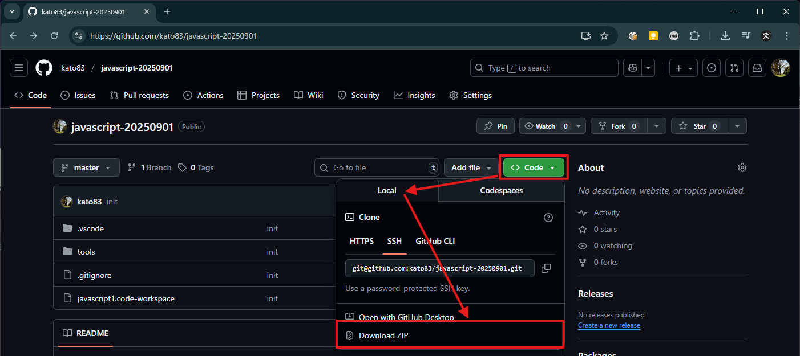

# セットアップ

1. 当ページの `Code > Local > Download ZIP` より開発資材のダウンロードを行ってください
   
2. ZIPファイルをデスクトップで解凍し、VSCodeを `javascript1.code-workspace` ファイルから開いてください。
3. VSCodeのメニューバーの `ターミナル > 新しいターミナル` よりWindowsのターミナル（PowerShell）をVSCode上で開き、以下のコマンドで正しく結果が出力されるかを確認してください。
   ```shel
   > node -v
   v22.19.0
   > npm -v
   10.9.3
   > node .\index.js
   Hello world!
   ```
   